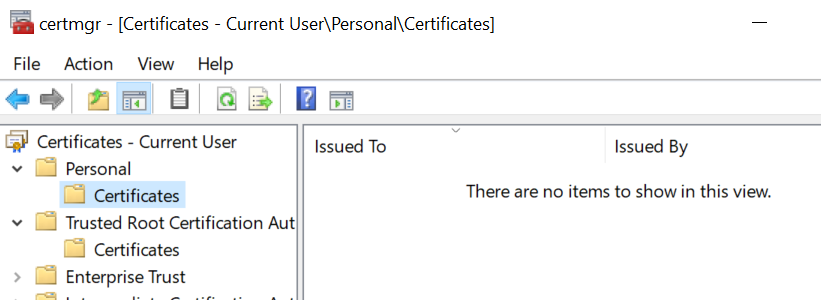
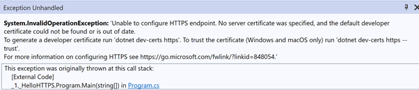
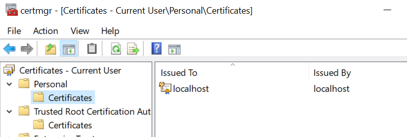
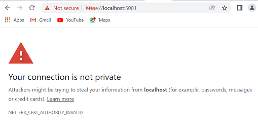

# HTTPS Local Development (Dev certificates and trust)

I have set up a super simple ASP.NET Core project that simply returns “Hello World”. In this project I have deliberately removed all IIS information from [launchsettings.json](./Properties/launchSettings.json). I have also removed the localhost certificate from the following location so there is no certificate. 



## Build and run the application

To build the application enter the command 

```
dotnet build
```

To run the application enter the command


```
dotnet run --launch-profile HelloHTTPS
```

Now when I run the application, I see the following error telling me I have no certificate. 



Let us go ahead and create a developer certificate as instructed.

```
dotnet dev-certs https
```

Let us go ahead and create a developer certificate as instructed. If we restart the certificate manager, we see a localhost certificate



Now if we go ahead and run the application we see the following in Chrome 



which we fix by running the command

```
dotnet dev-certs https --trust
```

Click yes on the popup and we are ready to go

[https://localhost:5001](https://localhost:5001)

