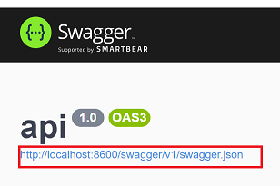

# Service to Service HTTP
## Synopsis
Shows how to wire a .NET service to another .NET HTTP Service using NSwag to generate the client. For details on NSwag and ASP.NET Core see [Get started with NSwag and ASP.NET Core](https://docs.microsoft.com/en-us/aspnet/core/tutorials/getting-started-with-nswag?view=aspnetcore-6.0&tabs=visual-studio) 

## Overview

The runtime topology is as follows.


To get both process running open the solutions in visual studio

* [./api/api.sln](./api/api.sln)
* [./router/router.sln](./router/router.sln)

And run the targets in debug mode. If we make a request on the routers swagger endpoint [swagger endpoint](http://localhost:8601/swagger/index.html) it will route the request to the api. We can check this by putting breakpoints in the two Controllers.


## NSwag Client Setup
### 1. Create solution folder in router (client) called Api.
Into this folder we need to add a [swagger.json](./router/Api/swagger.json) which we obtain from the Api service's [swagger endpoint](http://localhost:8600/swagger/index.html). 



We then add a file that tells swag how to build our client 

[nswag.json](./router/Api/nswag.json)

### 2. Enhance csproj file to build client
Now we need to add references to the [router.csprog file](./router/router.csproj) so it know how to build the client 

```
	<ItemGroup>
    <PackageReference Include="Swashbuckle.AspNetCore" Version="6.2.3" />
	  <PackageReference Include="NSwag.Commands" Version="13.14.4" />
	  <PackageReference Include="NSwag.MSBuild" Version="13.14.4">
		  <PrivateAssets>all</PrivateAssets>
		  <IncludeAssets>runtime; build; native; contentfiles; analyzers; buildtransitive</IncludeAssets>
	  </PackageReference>
  </ItemGroup>
```

### 3. Configure the client
We configure the generated client in [Program.cs](./router/Program.cs)

```cs
builder.Services.AddHttpClient<IApiClient, ApiClient>(client =>
{
    client.BaseAddress = new Uri("http://localhost:8600");
});

```

### 4. Inject Client into Controller and use it
See [HelloController.cs](./router/Controllers/HelloController.cs)